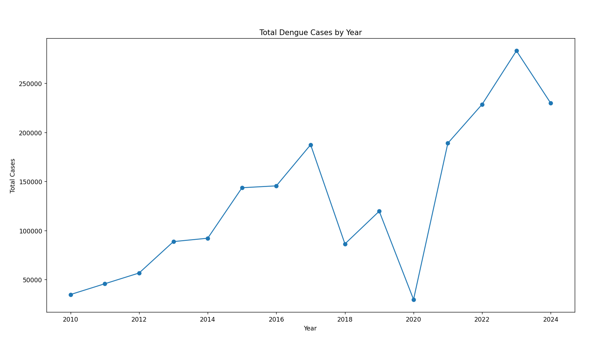
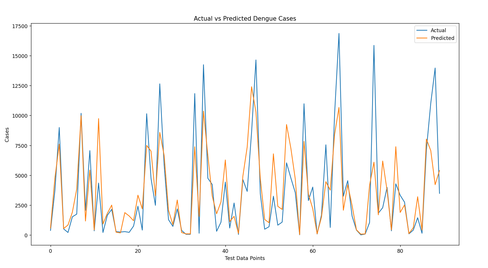
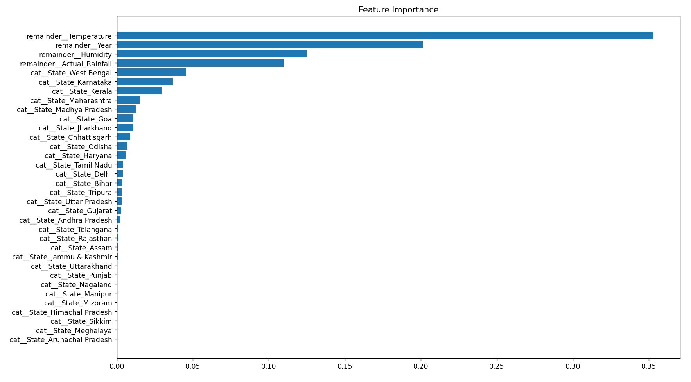
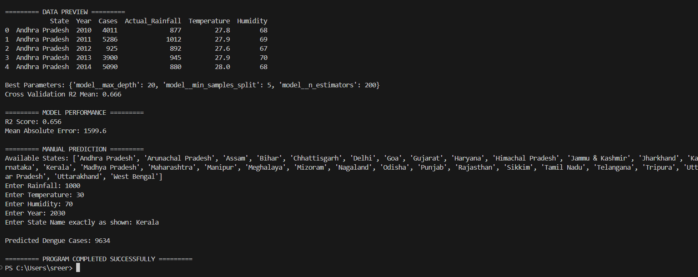

# 🌍 Climate-Aware Disease Outbreak Prediction

### Dengue Case Forecasting using Machine Learning

---

## 📌 Project Overview

Dengue fever is a climate-sensitive disease that affects millions each year. Traditional outbreak prediction methods are often slow and fail to capture complex environmental patterns.

This project builds a **machine learning-based prediction system** using climate data to forecast dengue cases across different Indian states.

---

## 🎯 Objective

* Predict dengue outbreaks using climate factors
* Enable early detection for better public health planning
* Demonstrate a complete end-to-end data science workflow

---

## 📊 Dataset Information

* **File:** `Mergeddataset.xlsx`

* **Target Variable:** Dengue Cases

* **Features Used:**

  * Year
  * Rainfall
  * Temperature
  * Humidity
  * State

* **Data Processing:**

  * Removed aggregated ("Total") rows
  * Train-Test Split: 80% / 20%
  * Outlier Removal: Top 5% (training only)
  * Missing Values: Imputed using mean

---

## ⚙️ Project Workflow

1. Data Loading & Cleaning
2. Train-Test Splitting
3. Outlier Removal (Training Data Only)
4. Missing Value Imputation
5. Feature Encoding (One-Hot Encoding for State)
6. Model Training (Random Forest Regressor)
7. Hyperparameter Tuning (GridSearchCV)
8. Model Evaluation (R² Score, MAE)
9. Prediction (Manual Input System)

---

## 🤖 Machine Learning Model

**Model Used:** Random Forest Regressor

* Handles non-linear relationships effectively
* Robust against overfitting
* Provides feature importance insights

**Hyperparameter Tuning:**

* `n_estimators`: 200, 500
* `max_depth`: None, 10, 20
* `min_samples_split`: 2, 5
* Cross-validation: 5-fold

---

## 📈 Results & Performance

* Strong predictive performance with optimized parameters
* Reliable R² score on test data
* Low Mean Absolute Error (MAE)
* Successfully captures climate-driven outbreak patterns

---

## 📉 Visualizations

### Dengue Cases Trend Over Years



---

### Actual vs Predicted Cases



---

### Feature Importance



---

### Sample Output



---

## 🚀 How to Run the Project

```bash
# Clone repository
git clone https://github.com/your-username/climate-aware-disease-outbreak-prediction.git

# Navigate to project folder
cd climate-aware-disease-outbreak-prediction

# Install dependencies
pip install -r requirements.txt

# Run the project
python src/dengue_prediction.py
```

---

## 📂 Project Structure

```
climate-aware-disease-outbreak-prediction/
│
├── data/
├── src/
├── images/
├── presentation/
├── README.md
├── requirements.txt
```

---

## 🧠 Key Learnings

* End-to-end Machine Learning pipeline design
* Data preprocessing and feature engineering
* Handling outliers and missing values
* Hyperparameter tuning using GridSearchCV
* Model evaluation and visualization
* Real-world problem solving using climate data

---

## 🔮 Future Improvements

* Integrate real-time climate APIs
* Deploy as a web application
* Add more geographical and temporal data
* Experiment with advanced models (XGBoost, LSTM)

---

## 👨‍💻 Developer

Sreerag S
BCA Data Science Student

---

## ⭐ Acknowledgement

This project demonstrates how data science can be applied to solve real-world public health challenges using climate data and machine learning.

---
